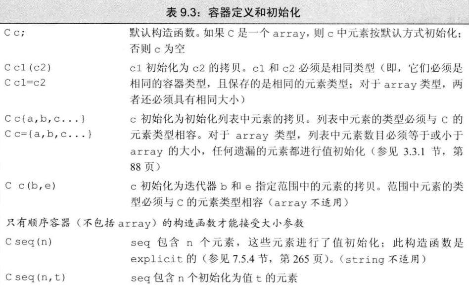
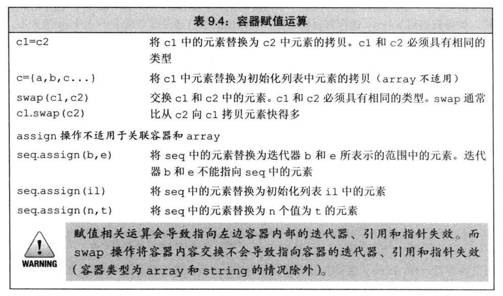
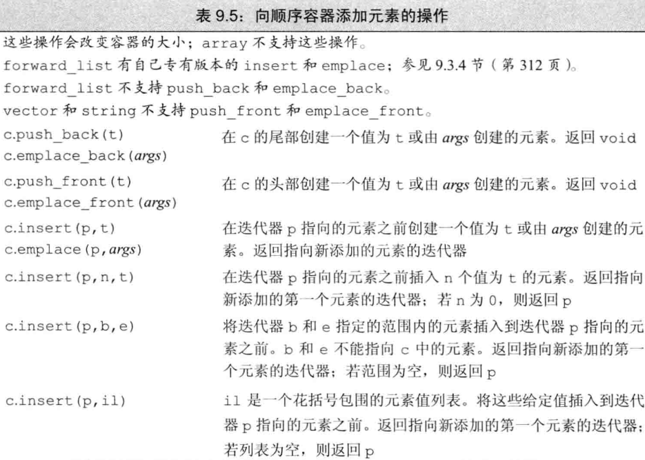
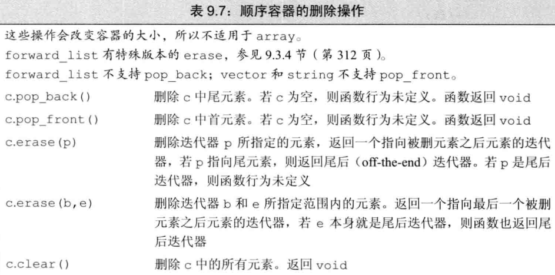
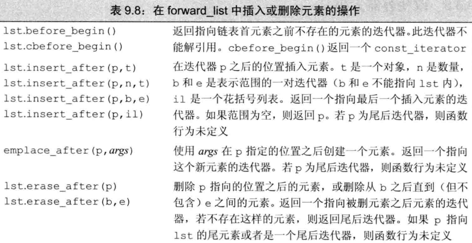

# part ii c++标准库 --顺序容器

>容器就是一些特定类型对象的集合。顺序容器为程序员提供了控制元素存储和访问顺序的能力，该位置与元素加入容器时的位置相对应。（关联容器根据关键字的值来存储元素）

## 1 顺序容器概述

顺序容器的类型：

+ **vertor** ，可变大小数组。支持快速随机访问。但在尾部之外插入或删除元素可能很慢。

+ **deque** ，双端队列。支持快速随机访问。在头尾插入/删除很快。
+ **list** ，双向链表。只支持双向顺序访问。任意位置插入/删除很快。
+ **forward_list** ，单向链表。只支持单向顺序访问。任意位置插入/删除很快。
+ **array** ，固定大小数组。支持快速随机访问。不能添加/删除元素。
+ **string** ，与vector相似的容器，专门用于字符。随机访问快，尾插/删快。

## 2 容器库概览

容器类型上的操作形成了一种层次：  
！某些操作是所有容器类型都提供的。  
！某些操作仅针对顺序容器、关联容器或者无序容器。  
！某些操作只适用于一小部分容器。

顺序容器几乎可以保存任意类型的元素。

`vector<Classname> myvec; //尖括号内指定元素类型`

需要注意的是，大多数STL容器**要求元素至少是可拷贝构造或可移动构造的**。我们可以为不支持特定操作需求的类型定义容器，但这样的话就只能使用那些没有特殊要求的容器操作了。  
例如，顺序容器一个版本的构造函数接受容器大小参数，他需要使用元素类型的默认构造函数（需要先分配空间，再构造对象）。但某些类没有默认构造函数的话，我们在构造这种容器时就不能只传递给他一个元素数目参数。

`vector<ClassNoDefault> v1(10, init); //正确，提供了元素初始化器`  
`vector<ClassNoDefault> v2(10); //错误`

### 2.1 基础容器操作

---

#### 容器类中的类型别名

+ **iterator** $~~~~~~~~~~~~~~~~~~~~~$此容器类型的迭代器类型

+ **const_iterator** $~~~~~~~~~~$只读迭代器类型
+ **size_type** $~~~~~~~~~~~~~~~~~$无符号整数类型，足以保存此种容器最大可能的大小
+ **difference_type**$~~~~~~~~$带符号整数类型，足够保存两个迭代器之间的距离
+ **value_type** $~~~~~~~~~~~~~~~$容器中元素的类型
+ **reference** $~~~~~~~~~~~~~~~~~$元素的左值类型，与value_type含义相同
+ **const_reference** $~~~~~$ 元素的const左值类型。

>对于difference_type和容器C，有两个迭代器it1和it2，我们可以用`C<int>::difference_type distance = it1 - it2;`得到迭代器距离。在c++11标准后，可以使用**auto**自动推断值类型。

>左值即能获取其具体地址的表达式，可以出现在等号左边或右边。右值通常是临时对象（函数返回的非引用类型），即将销毁的对象，或字面量（15，114），表达式结果（a + b），std::move(x)的返回值等，无法获取其地址，只能出现在等号右边。

---

#### 构造函数

+ **Container ctn;**$~~~~~~~~~~~~~~~~~~~~~~~~$默认构造函数，构造空容器。

+ **Container ctn1(ctn2);** $~~~~~~~~~~~~$构造ctn2的拷贝ctn1。
+ **Container ctn(bgin, ed);** $~~~~~~~~$将迭代器bgin和ed指定范围的元素拷贝到ctn（array不支持）
+ **Container ctn{a, b, c...};** $~~~~~~~~$列表初始化ctn。

---

#### 赋值与交换swap

+ **ctn1 = ctn2;** $~~~~~~~~~~~~~~~~~~~~$将ctn1中的元素替换为ctn2中的元素。

+ **ctn = {a, b, c...};** $~~~~~~~~~~~~~$将ctn中的元素替换为列表中元素。
+ **ctn1.swap(ctn2);** $~~~~~~~~~~~~$交换ctn1和ctn2的元素。
+ **swap(ctn1, ctn2);**$~~~~~~~~~~~~$相当于`ctn1.swap(ctn2);`

---

#### 大小

+ **ctn.size()** $~~~~~~~~~~~~~~~~~~~~~$ ctn中元素的数目(forward_list不支持)

+ **ctn.max_size()** $~~~~~~~~~~~~~$ ctn可存的最大元素数目。
+ **ctn.empty()** $~~~~~~~~~~~~~~~~~$ 若ctn为空，返回true，否则false。

---

#### 添加/删除元素(array不适用)

+ **ctn.insert(args)** $~~~~~~~~~~~~~$ 将args中的元素拷贝进ctn。

+ **ctn.emplace(inits)** $~~~~~~~~~$ 使用inits构造ctn中的一个元素
+ **ctn.erase(args)** $~~~~~~~~~~~~~$ 删除args指定的元素。
+ **ctn.clear()** $~~~~~~~~~~~~~~~~~~~~~$ 删除ctn所有元素，返回void。

>insert方法需要先创建一个对象，再拷贝/移动进容器，而emplace方法是将传入的inits直接作为构造函数的参数，在内存中原地构造一个元素。这省去的中间对象与拷贝操作，更高效，支持复杂构造。

---

#### 关系运算符

+ **== !=** $~~~~~~~~~~~~~~~~$ 所有容器都支持，比较大小，元素逐个相等与否。

+ **< <= > >=** $~~~~~~~~~$ 规则类似字符串比较，不支持无序关联容器。

>只有当元素类型也定义了相应的比较运算符时，我们才能用关系运算符来比较两个容器。

---

#### 获取迭代器

+ **ctn.begin()，ctn.end()** $~~~~~~~~$ 返回指向**首元素**或指向**尾元素之后位置**的迭代器。

+ **ctn.cbegin()，ctn.cend()** $~~~~$ 返回const_iterator。

---

#### 反向容器的而外成员(不支持forward_list)

+ **reverse_iterator** $~~~~~~~~~~~~~~~~~~~~~~~~$逆序寻址元素的迭代器。

+ **const_reverse_iterator** $~~~~~~~~~~~~~$只读逆序迭代器。
+ **ctn.rbegin()，ctn.rend()** $~~~~~~~~~~~~$不用说了吧。
+ **ctn.crbegin()，ctn.crend()** $~~~~~~~~$ 1！5！

---

### 2.2 小谈迭代器

>更多迭代器的内容在泛型算法内。

#### 迭代器使用

移动迭代器：`++iter`或`--iter`。对于反向迭代器来说 ++ 运算符意味着逆向移动。  
使用**解引用运算符***来访问迭代器指向的元素。

#### 迭代器范围

一个迭代器范围由一对迭代器表示。这个范围是一个左闭右开的区间。假设有一对迭代器 it1 和 it2 ，范围则是
$$[ it1, it2 )$$  
it2 可以指向与 it1 相同的位置，但不能指向 it1 之前的位置。注意编译器不会检查到这个可能的错误。

一种用法：

`while(begin != end) {`  
$~~~~$`*begin = val;`  
$~~~~$`++begin;`  
`}`

#### 重载过的begin()与end()

生成迭代器的这两个函数（所有不是以c开头的这些函数）实际上有一个重载的const版本，当容器实例是const的时候使用。c++11后引入了c开头的 cbegin() ，cend() 等，用以支持**auto**与begin()和end()结合使用。在这之前，只能显式声明是那种类型的迭代器。

---

### 2.3 容器定义和初始化

主要方法和2.1中给出的一样，不过内容更详细一点。直接贴图片出来了。

#### 将一个容器初始化为另一个容器的拷贝

这种方法有方式：一个是拷贝整个容器，但要求容器类型和元素类型必须都一致。或者可以使用一对迭代器拷贝一个范围，这种方式不要求容器类型相同，两容器的元素类型也可以不同，只要能将要拷贝的元素转化为新容器的元素类型即可。

#### 与顺序容器大小相关的构造函数

除了与关联容器相同的改造函数除外，顺序容器(array除外)还提供另一个构造函数，接受容器大小与(可选的)元素初始值。

`list<int> nums(10, 5); //10个int元素，每个初始化为5`  
`deque<string> strs(10); //10个string元素，每个默认初始化为空`

#### array定义时需要大小

标准库array的大小是类型的一部分。定义一个array时，除了指定元素类型，还要指定容器大小。

`array<int, 15> //类型为：保存15个int的array`

`array<int>::size_type i; //错误，array<int>不是一个类型`

#### 赋值和swap

使用assign时，容器会被清空，然后填充新元素，同时大小也会重置为新元素的个数，对每个新元素，会调用拷贝构造/移动构造函数。

---

### 2.4 顺序容器操作  

>**向一个vector、string、deque插入元素会使所有指向容器的迭代器、指针、引用失效。**  
**删除deque中除头尾之外的元素会使所有迭代器、引用、指针失效。**  
**指向vector或string删除点之后位置的迭代器、引用、指针会失效。**

>单向链表不支持尾插尾删。  
 vector 和 string 不支持头插。

.  

>注意insert()与emplace()的返回值，返回指向新元素的迭代器，同时他们在传入迭代器指向的位置前插入元素。这让我们可以在一个特定位置循环插入。

.  

#### 特别的单链表操作

>由于单链表不具备快速访问上一个元素的能力，因此在给定位置的前面进行插入删除的insert/emplace/erase，对于单链表来说行不通（因为需要改变前一个元素的next指针）。  
于是单链表的做法是在给定位置之后进行插入。

#### 访问元素

# bottom
